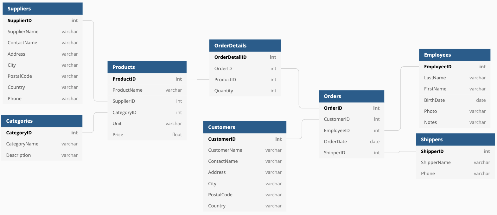

# SQL10 本ノック

## 課題内容

[airtable](https://airtable.com/tblTnXBXFOYJ0J7lZ/viwyi8muFtWUlhNKG/recUtU0RUu8Daymau?blocks=hide)

---

## 課題 1(実装)


[DB Diagram](./db_diagram/DB_Diagram.md)

### 1. 「常連顧客を特定して欲しい」

#### 1996 年に 3 回以上注文した（Orders が 3 つ以上紐づいている）Customer の ID と、注文回数を取得してみてください

[実行結果](./output_images/order_count_3.png)

[実行クエリ](./src/order_count_3.sql)

#### 最もよく注文してくれたのは、どの Customer でしょうか？

[実行結果](./output_images/most_orders_customer_in_1996.png)

[実行クエリ](./src/most_orders_customer_in_1996.sql)

- 疑問
  - サブクエリ使いすぎマンになってしまった。
  - しょうがない？
- 参考文献
  - [今更だけど SQL で count した中から max 値を取得する | Qiita](https://qiita.com/Kuzira_Kuzira/items/3106748174ef7fb6d907)

### 2. 過去最も多くの OrderDetail が紐づいた Order を取得してください。何個 OrderDetail が紐づいていたでしょうか？

[実行結果](./output_images/most_orders.png)

[実行クエリ](./src/most_orders.sql)

- 疑問
  - 過去最も多くの OrderDetail が紐づいた Order は 10 record 存在したが、今回は設問上 OrderID の降順で 1 件のみ取得した
    - わざわざ 1 件に絞る必要ある？
      - 要望上、複数件出力する必要がないからかな？
    - なぜ OrderID の降順なのだろうか（特に深い意味はないと思ってる）

### 3. Order 数が多い順番に Shipper の id を並べてください。Order 数も表示してください

[実行結果](./output_images/most_orders_shipper.png)

[実行クエリ](./src/most_orders_shipper.sql)

### 4. 売上が高い順番に Country を並べてください。売上も表示してください

[実行結果](./output_images/sales_country.png)

[実行クエリ](./src/sales_country.sql)

### 5. 国ごとの売上を年ごとに集計する

[実行結果](./output_images/sales_country_year.png)

[実行クエリ](./src/sales_country_year.sql)

### 6. Employee テーブルに「Junior（若手）」カラム（boolean）を追加

[実行結果](./output_images/junior.png)

[実行クエリ](./src/junior.sql)

## 7. Shipper に long_relation カラム（boolean）を追加

[実行結果](./output_images/long_relation.png)

[実行クエリ](./src/long_relation.sql)

## 8. それぞれの Employee が最後に担当した Order と、その日付

[実行結果](./output_images/latest_order.png)

[実行クエリ](./src/latest_order.sql)

## 8. NULL の扱いに慣れる

[実行結果](./output_images/customers_with_name.png)
[実行クエリ](./src/customers_with_name.sql)

[実行結果](./output_images/customer_without_name.png)
[実行クエリ](./src/customer_without_name.sql)

## 9. JOIN の扱いになれる

[実行結果](./output_images/employee_not_shown.png)
[実行クエリ](./src/employee_not_shown.sql)

[実行結果](./output_images/employee_null.png)
[実行クエリ](./src/employee_null.sql)

## 課題 2(質問)

### WHERE と HAVING のそれぞれの違いを教えてください

- WHERE
  - WHERE 句の条件によってグループ化する対象のレコードが制限される
  - グループ化する対象レコードを絞り込みたい場合に利用する
- HAVING

  - HAVING 句によって指定された条件を満たすグループが取り出される
  - グループ化した後に、グループを絞り込みたい場合に利用する

- 順序
  1. WHERE 句の条件によってグループ化する対象のレコードが制限される
  2. GROUP BY 句によってグループ化される
  3. グループ関数が適用される
  4. HAVING 句によって指定された条件を満たすグループが取り出される

### DDL、DML、DCL、TCL とは何か？

- DDL(Data Definition Language)
  - 表などのデータベースオブジェクトを作成・変更・削除する
  - コマンド
    - CREATE, ALTER, DROP, RENAME, TRUNCATE, COMMENT
- DML(Data Manipulation Language)
  - 表内のデータを直接操作する
  - コマンド
    - SELECT, INSERT, UPDATE, DELETE, MERGE
- DCL(Data Control Language)
  - データベースに対する権限を付与したり、取り消したりする
  - コマンド
    - GRANT, REVOKE
- TCL(Transation Control Language)
  - トランザクションを制御する
  - コマンド
    - COMMIT, ROLLBACK, SAVEPOINT

## 課題 3(クイズ)

### クイズ 1

Null 値は特殊な値のため、列に Null 値が含まれるかどうかは`IS NULL`演算子もしくは`IS NOT NULL`演算子でしか評価できません。
では、以下のように評価対象が`Null`の場合、出力結果はどうなるでしょうか？

```sql
SELECT * FROM Customers WHERE CustomerName = NULL;
```

<details><summary>回答</summary><div>

SQL はエラーにはならず、結果は 1 件も取り出されない。

（Null 値はどのような値に対しても等しいまたは等しくないという評価ができない。）

</div></details>

### クイズ 2

SQL クエリでは列別名を指定することができます。

`GROUP BY句`では列別名を利用することができず、`ORDER BY句`では列別名を利用できる理由を教えてください。

**ヒント:** **評価順序**

<details><summary>回答</summary><div>

`GROUP BY句`は`SELECT句`よりも評価順序が早く、`ORDER BY句`は`SELECT句`よりも評価順序が遅いから。

- 参考記事
  - [ORDER BY 句で別名が使えて GROUP BY 句では別名が使えない理由](https://muroiwataru.net/entry/sql-order-by)
  - [https://qiita.com/k_0120/items/a27ea1fc3b9bddc77fa1](https://qiita.com/k_0120/items/a27ea1fc3b9bddc77fa1)
  - [SELECT 文の評価順序の話](https://qiita.com/suzukito/items/edcd00e680186f2930a8)

</div></details>

### クイズ 3

`GROUP BY句` と `HAVING句` はどちらを先に記述すべきでしょうか？

<details><summary>回答</summary><div>

どちらを先に記述しても、同様に動作する。

しかし、処理の流れに合わせて、`GROUP BY句` を先に記述してより論理的に分かりやすくすることが推奨されている。

</div></details>

### クイズ 4

`GROUP BY句` を指定せずに `HAVING句` は指定した場合、どうなるでしょうか？

エラーとなるでしょうか？エラーとならない場合は、どのような処理がされるでしょうか？

<details><summary>回答</summary><div>

エラーにならない。

選択された行全体が 1 グループとして処理される。

</div></details>

## 疑問

- `between` の挙動が想定と異なる気がする？

  - 1996 年のデータを取得するとき

    想定してたクエリ

    ```sql
    where orderdate between '1996-01-01' and '1997-01-01'
    ```

    実際のクエリ

    ```sql
    where orderdate between '1996-01-01' and '1996-12-31'
    ```

    確か SQL って国際標準で文法があった気がする。WebSQL は準じていないのかな？そもそも WebSQL のサポートしている構文はどこで確認できるんだろう

  - 解決
    - Web SQL は、Sqlite 3.6.19 でサポートされている SQL 構文と同様。
      - [5 Web SQL](https://www.w3.org/TR/2010/NOTE-webdatabase-20101118/#web-sql)
        > User agents must implement the SQL dialect supported by Sqlite 3.6.19.
    - Sqlite は `between 'date1' and 'date2'` のとき、date2 を含む
      - [SQLite BETWEEN dates example](https://www.sqlitetutorial.net/sqlite-between/)

## メモ

- SQL Formatter 導入
  - [SQL Formatter](https://marketplace.visualstudio.com/items?itemName=adpyke.vscode-sql-formatter)
- 表別名と列別名（Oracle の場合）

  ※ SQLite は表列名も列別名もどちらも`as`もしくは空白を利用可能

  - 列別名では`as`もしくは空白を利用する

    as

    ```sql
    select column_name as another_column_name from [table_name];
    ```

    空白

    ```sql
    select column_name another_column_name from [table_name];
    ```

  - 表別名では 空白を利用する
    ```sql
    select column_name from [table_name] another_table_name;
    ```
