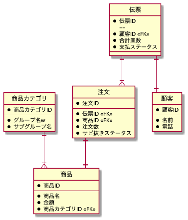

# DB モデリング 1

## 課題内容

[airtable](https://airtable.com/tblTnXBXFOYJ0J7lZ/viwyi8muFtWUlhNKG/recWPAwB0NWLdQTxO?blocks=hide)

---

## 課題 1

### 作業ステップ

1. イベントを見つける

   イベントは「注文」。なぜなら、「〜する」という表現が可能だから。

   ```sql
   -- イベント系
   TABLE 注文 {
   }
   ```

2. リソースを見つける

   リソースは「顧客」「商品」「商品カテゴリ」「伝票情報」。なぜなら、「〜する」という表現が成立しないから。

   ※リソース項目: 「誰に」「誰が」「何を」「どこ」

   ```sql
   -- イベント系
   TABLE 注文 {
   }

   -- リソース系
   TABLE 顧客 {
   }
   TABLE 商品 {
   }
   TABLE 商品カテゴリ {
   }
   TABLE 伝票情報 {
   }
   ```

   「見たままをデータモデルにすること」を重視して、イベント・リソース系の列挙はここまでとする。

3. スキーマの項目を埋める

   ```sql
    -- イベント系
    TABLE 注文 {
      注文数
      サビ抜きステータス
    }


    -- リソース系
    TABLE 顧客 {
      名前
      電話
    }
    TABLE 商品 {
      商品名
      金額
    }
    TABLE 商品カテゴリ {
      グループ名
      サブグループ名
    }
    TABLE 伝票情報 {
      合計皿数
      支払ステータス
    }
   ```

4. ID の導入

   ```sql
    -- イベント系
    TABLE 注文 {
      ID
      注文数
      サビ抜きステータス
    }

    -- リソース系
    TABLE 顧客 {
      ID
      名前
      電話
    }
    TABLE 商品 {
      ID
      商品名
      金額
    }
    TABLE 商品カテゴリ {
      ID
      グループ名
      サブグループ名
    }
    TABLE 伝票情報 {
      ID
      合計皿数
      支払ステータス
    }
   ```

5. リレーションの設定

   

6. DB スキーマのリファクタリング

   - 合計金額・消費税・注文日時を追加
   - サビ抜きと支払いステータスは現状 0/1 想定のため、正規化しない

   

## 課題 2

### 変更点 1 対応

### 変更点 2 対応
