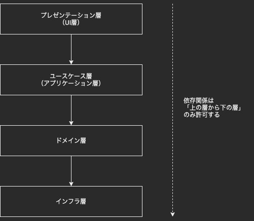

# オニオンアーキテクチャを学ぶ

## 課題内容

[airtable](https://airtable.com/tblTnXBXFOYJ0J7lZ/viwyi8muFtWUlhNKG/recX7t40cIoegtn7Q?blocks=hide)

---

## 課題 1

### 図解


ドメイン駆動設計 モデリング/実装ガイド を参考にした

### ドメイン層のメリット

- ドメイン層は、他のどの層にも依存しない
  - つまり、特定の DB やフレームワークに依存しない
  - そのため、修正しやすくなる
  - 結果的に、DB やフレームワークの都合で修正しづらい問題や理想的ではない実装も排除することができる
    - そもそもドメインモデルは、頻繁に更新し、実装に反映するもの
  - 副次的なメリットとしては、移植が容易になることも挙げられる

### インターフェース依存のメリット

- インターフェースに対する依存のみ許可することで、依存の方向がより安定した方向に向かうことになる
  - そのため、修正頻度・修正範囲が低く小さく抑えられる
  - もし具体に依存していた場合、
    - 具体はインターフェースと比較して不安定である
    - 具体は不安定なので、頻繁に変更修正される
    - 具体に依存していると、依存元も頻繁に変更修正が必要になってしまう

[安定依存の原則 （SDP: Stable Dependencies Principle）](<https://at-grandpa.hatenablog.jp/entry/dip#:~:text=%E3%81%93%E3%81%93%E3%81%AB%E5%AE%89%E5%AE%9A%E6%80%A7%E3%81%AE%E5%B7%AE%E3%81%8C%E3%81%82%E3%82%8A%E3%81%BE%E3%81%99-,%E5%AE%89%E5%AE%9A%E4%BE%9D%E5%AD%98%E3%81%AE%E5%8E%9F%E5%89%87%20(sdp%3A%20stable%20dependencies%20principle),-%E8%A8%AD%E8%A8%88%E5%8E%9F%E5%89%87%E3%81%AE%E4%B8%80%E3%81%A4%E3%81%AB>)

中野さんに紹介してもらった記事の例が、非常にわかりやすい

### 依存性の逆転 と オニオンアーキテクチャ

#### レイヤードアーキテクチャ

オニオンアーキテクチャと依存性の逆転の前に、レイヤードアーキテクチャについて



- レイヤードアーキテクチャの問題点
  - ドメイン層がインフラ層に依存している
  - ドメイン層にリポジトリを置く場合、リポジトリが DB や ORM に依存した実装になってしまう
  - つまり、ドメイン層が特定のインフラ技術に依存してしまう

#### オニオンアーキテクチャ

オニオンアーキテクチャ = レイヤードアーキテクチャから、依存性の逆転を用いてドメイン層とインフラ層の依存関係を逆転させたもの

- どのように使われているか?
  - インフラ層にリポジトリの実装クラスを、ドメイン層にリポジトリのインターフェースを定義する。
  - そうすることで、
    - ドメイン層 -> インフラ層 の依存関係が
    - インフラ層 -> ドメイン層 の依存関係へ変化した（逆転した）

#### 疑問

- 「ドメイン層がインフラ層に依存している」という状態を示すサンプルコードないかな？
  - コードレベルでダメな例がわからなかった

### アクセス制限機能

- 仕様

  - Todo を作成できるのは、Admin ユーザーのみ。
  - Todo を更新できるのは、Admin ユーザーのみ。

- どの層に記述するか？
  - プレゼンテーション層
    - ×
    - プレゼンテーション層は、ユーザーやフロントエンド、他のサービスとのインターフェースである。
    - そのためプレゼンテーション層では、入力形式や出力形式のバリデーションを行うべきである。
    - 言い換えると、入出力形式以外のバリデーションは実施すべきではない。
  - ユースケース層
    - △
    - ユースケースに How が記述してあるのは、気持ち悪い
    - もし他のユースケースでタスクを作成する際に、同様の if 文を書かないといけない（漏れが発生するかも
  - ドメイン層
    - ○
    - ドメインにルール/制約がまとまっている
    - Admin ユーザー以外は Todo を作成することは不可能になった
    - ただし、実装方法に不安点あり。
      - Todo のコンストラクタに User インスタンスがあってもいいのかな？

#### ユースケース層に記述するサンプルコード

```ts
class TodoUsecase {
  private todoRepository: ITodoRepository;
  private userRepository: IUserRepository;

  constructor(
    todoRepository: ITodoRepository,
    userRepository: IUserRepository
  ) {
    this.todoRepository = todoRepository;
    this.userRepository = userRepository;
  }

  createTodo(content: string, user_id: string): void {
    const user = userRepository.getUser(user_id);
    // ユースケースにHowが記述してある
    if (user.getRole != "ADMIN") {
      throw new Error("Todo を作成できるのは、Admin ユーザーのみです");
    }

    const todo = new Todo(content);
    todoRepository.create(todo);
  }

  updateTodo(task_id: string, content: string, user_id: string): void {
    const user = userRepository.getUser(user_id);
    // ユースケースにHowが記述してある
    if (user.getRole != "ADMIN") {
      throw new Error("Todo を作成できるのは、Admin ユーザーのみです");
    }

    const todo = todoRepository.getByTodoId(task_id);
    todo.updateContent(content);
    todoRepository.save(todo);
  }
}

class Todo {
  private readonly id: string;
  private readonly content: string;

  // コンストラクタの引数は、Todoのフィールドに関連するものだけ
  constractor(content: string) {
    if (!content) {
      throw new Error("必須項目が設定されていません");
    }

    this.id = uuidv4();
    this.content = content;
  }

  updateContent(content: string) {
    this.content = content;
  }
}

class User {
  private readonly id: string;
  private readonly name: string;
  private readonly role: "ADMIN" | "GENERAL";

  constractor(name: string, role: string) {
    if (!name || !role) {
      throw new Error("必須項目が設定されていません");
    }

    if (!(role === "ADMIN" || role === "GENERAL")) {
      throw new Error("ユーザーに付与できる権限は、ADMIN か GENERAL のみです");
    }

    this.id = uuidv4();
    this.name = name;
    this.role = role;
  }
}
```

#### ドメイン層に記述するサンプルコード

```ts
class TodoUsecase {
  private todoRepository: ITodoRepository;
  private userRepository: IUserRepository;

  constructor(
    todoRepository: ITodoRepository,
    userRepository: IUserRepository
  ) {
    this.todoRepository = todoRepository;
    this.userRepository = userRepository;
  }

  createTodo(content: string, user_id: string): void {
    // ユースケースからHowが消えた
    const user = userRepository.getUser(user_id);
    const todo = new Todo(content, user);
    todoRepository.create(todo);
  }

  updateTodo(task_id: string, content: string, user_id: string): void {
    // ユースケースからHowが消えた
    const todo = todoRepository.getByTodoId(task_id);
    const user = userRepository.getUser(user_id);
    todo.updateContent(content, user);
    todoRepository.save(todo);
  }
}

class Todo {
  private readonly id: string;
  private readonly content: string;

  // コンストラクタの引数に、別ドメインの情報が関連している
  constractor(content: string, user: User) {
    if (!content) {
      throw new Error("必須項目が設定されていません");
    }

    if (user.getRole != "ADMIN") {
      throw new Error("Todo を作成できるのは、Admin ユーザーのみです");
    }

    this.id = uuidv4();
    this.content = content;
  }

  updateContent(content: string, user: User) {
    if (user.getRole != "ADMIN") {
      throw new Error("Todo を作成できるのは、Admin ユーザーのみです");
    }

    this.content = content;
  }
}

class User {
  private readonly id: string;
  private readonly name: string;
  private readonly role: "ADMIN" | "GENERAL";

  constractor(name: string, role: string) {
    if (!name || !role) {
      throw new Error("必須項目が設定されていません");
    }

    if (!(role === "ADMIN" || role === "GENERAL")) {
      throw new Error("ユーザーに付与できる権限は、ADMIN か GENERAL のみです");
    }

    this.id = uuidv4();
    this.name = name;
    this.role = role;
  }
}
```

### DB 変更

- インフラ層?
  - リポジトリのインターフェースの実装クラスをインフラ層に新たに作成する（オープン・クローズドの原則
- チームのコードだったら
  - infrastructure 配下に`PostgreSQLClient.ts`を作成する
  - interfaces/repository 配下の`TodoRepository.ts`(リポジトリの実装クラス) の DI 先を MySQL から PostgreSQL に変更する
    - 変更点は、constructor と リポジトリの各メソッド内で infrastracture を呼んでいる箇所

```
root
+-- src
    |-- application
    |   |-- repositories
    |   |   +-- ITodoRepository.ts
    |   +-- usecases
    |       +-- TodoUsecase.ts
    |-- domain
    |   +-- models
    |       |-- Todo.ts
    |       +-- User.ts
    |-- infrastructure
    |   |-- MySqlClient.ts
    |   +-- PostgreSqlClient.ts
    +-- interfaces
        |-- controllers
        |   +-- TodoController.ts
        +-- repository
            +-- TodoRepository.ts
```

## 課題 2

### クイズ 1

Entity などのドメインオブジェクトからリポジトリを呼んでも良いでしょうか？

<details><summary>回答</summary><div>

- 良くない。
- なぜなら、保守しづらく意図しないコードになるから。
- 参考記事
  - [issues/375 | ddd-q-and-a](https://github.com/little-hands/ddd-q-and-a/issues/375)
  - [issues/443 | ddd-q-and-a](https://github.com/little-hands/ddd-q-and-a/issues/443)

</div></details>

### クイズ 2

リポジトリからリポジトリを呼んでも良いでしょうか？

<details><summary>回答</summary><div>

- 良くない。
- なぜなら、リポジトリの呼び出し元からは想像しない DB アクセスが発生する可能性があるから。
- 参考記事
  - [issues/373 | ddd-q-and-a](https://github.com/little-hands/ddd-q-and-a/issues/373)

</div></details>

### クイズ 3

ユースケースからユースケースを呼んでも良いでしょうか？

<details><summary>回答</summary><div>

- 良くない。
- なぜなら、高結合になるから。（ユースケース A は、ユースケース B と C を用いる。みたいなことを許すと階層が深くなってしまう）
- 参考記事
  - [issues/285 | ddd-q-and-a](https://github.com/little-hands/ddd-q-and-a/issues/285)
  - [ドメイン駆動設計を導入するために転職して最初の 3 ヶ月でやったこと[DDD]](https://little-hands.hatenablog.com/entry/2020/12/22/ddd-in-first-3month#:~:text=%E7%AC%91-,%E3%83%AC%E3%82%A4%E3%83%A4%E3%83%BC%E3%81%93%E3%82%99%E3%81%A8%E3%81%AE%E3%82%AA%E3%83%95%E3%82%99%E3%82%B7%E3%82%99%E3%82%A7%E3%82%AF%E3%83%88%E3%81%AE%E4%BE%9D%E5%AD%98%E9%96%A2%E4%BF%82%E3%82%92%E6%95%B4%E7%90%86,-Service%E3%82%AF%E3%83%A9%E3%82%B9%E5%90%8C%E5%A3%AB%E3%81%8C%E5%91%BC%E3%81%B3%E5%90%88%E3%81%A3%E3%81%A6%E3%81%97%E3%81%BE%E3%81%86%E3%81%A8)

</div></details>

### クイズ 4

アプリケーション層からリポジトリを呼んでも良いでしょうか？

<details><summary>回答</summary><div>

- 良くない。
- なぜなら、責務外の処理だから。
- 参考記事
  - [issues/310 | ddd-q-and-a](https://github.com/little-hands/ddd-q-and-a/issues/310)

</div></details>
