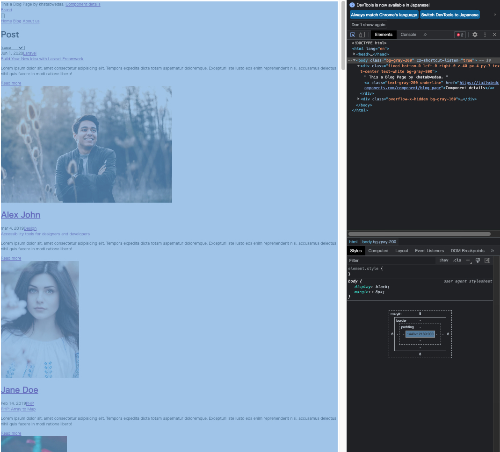
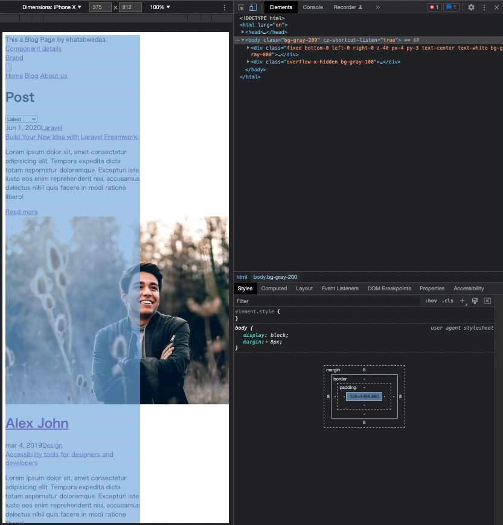

# 作ったページをレスポンシブ対応しよう
## 課題内容

[airtable](https://airtable.com/appWjizyFJue33ycs/tblTnXBXFOYJ0J7lZ/viwyi8muFtWUlhNKG/recoEoo6MQ71gvxqZ?blocks=hide)

---

## 課題 1
### PC と iPhone X のスタイルの違いの確認
- 参考サイト
  - PC
    - 
  - iPhone X
    - 
- 違い
  - ~~画面の横幅が異なる~~
  - ~~（逆にそれ以外の違いがわからなかった）~~
  - tailwind css を適用したら、レスポンシブ対応された・・・

### 対応内容
- [PR](https://github.com/kooooichi24/nextjs-tutorial/pull/2)

## 参考文献
- [なぜ初心者は「UIコンポーネントにマージンをつけるのか」初心者が解説します](https://zenn.dev/ryusou/articles/why-margin-component)
- [CSSとコンポーネント設計に対する考察](https://blog.uhy.ooo/entry/2020-12-19/css-component-design/#classname%E3%82%92%E6%B8%A1%E3%81%97%E3%81%A6%E3%82%B3%E3%83%B3%E3%83%9D%E3%83%BC%E3%83%8D%E3%83%B3%E3%83%88%E3%82%92%E6%8B%A1%E5%BC%B5%E3%81%99%E3%82%8B)
- [まとまったCSSを別のコンポーネントに分けないでほしい話](https://blog.uhy.ooo/entry/2020-10-15/react-paired-css/#%E8%89%AF%E3%81%8F%E3%81%AA%E3%81%84%E4%BE%8B)
- [フロントエンドのコンポーネント設計に立ち向かう](https://qiita.com/seya/items/8814e905693f00cdade2)
- [アンチパターン: コンポーネントのpropsにclassNameがある / STORES 予約 のReactで踏み抜いたアンチパターンと現在](https://tech.hey.jp/entry/2021/12/02/100342#:~:text=%E3%82%A2%E3%83%B3%E3%83%81%E3%83%8F%E3%82%9A%E3%82%BF%E3%83%BC%E3%83%B3%3A%20%E3%82%B3%E3%83%B3%E3%83%9B%E3%82%9A%E3%83%BC%E3%83%8D%E3%83%B3%E3%83%88%E3%81%AEprops%E3%81%ABclassname%E3%81%8B%E3%82%99%E3%81%82%E3%82%8B)
- [Reactのベストプラクティスとコード削減パターン - パート2](https://blog.microcms.io/react-best-practices-part2/)