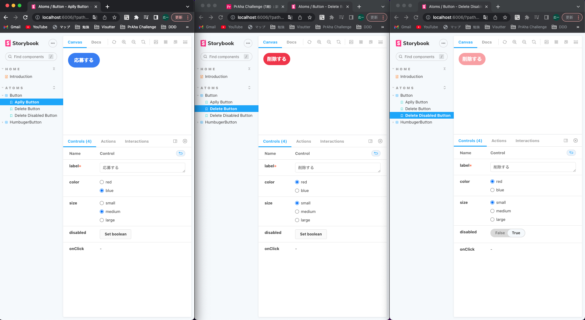

# よくあるボタンコンポーネントを作成する
## 課題内容

[airtable](https://airtable.com/appWjizyFJue33ycs/tblTnXBXFOYJ0J7lZ/viwyi8muFtWUlhNKG/recP07wCjtUBvjeI5?blocks=hide)

---

## 課題 1
別リポジトリで作成したため、[PRはこちら](https://github.com/kooooichi24/nextjs-tutorial/pull/3/commits/8ae8a796e920cd888ab910785edac88b214f4c1f)

[mui](https://github.com/mui/material-ui/blob/master/packages/mui-material/src/Button/Button.js)や[ant-design](https://github.com/ant-design/ant-design/blob/master/components/button/button.tsx)のボタンコンポーネントは、読み解くのが大変、、、理解できなかった

## 課題 2

## 課題 3
- props 定義派
  - テキスト文言だけを受け取る `props` を定義した方が良いと思う。なぜなら、インターフェースを限定することで、意図しない使用方法を防ぐためだ。
  - `children` は `ReactNode` 型を受け取ることができる。`ReactNode` の型定義は `type ReactNode = ReactElement | string | number | ReactFragment | ReactPortal | boolean | null | undefined;` である。一方テキスト文言だけを受け取る場合、型定義は `label: string` となる。
  - 型定義を比較すると `children` の方が汎用的である。
  - 脳死で `children` を許容してしまうと、コンポーネントの責務が曖昧になってしまう。
ハンバーガーメニュを `button` タグで実現したいから、 ボタンコンポーネントに `children` を許容するのではなく、ハンバーガーメニューとボタンコンポーネントは別々のコンポーネントとするべきである。
- children 派
  - children を採用すべきである。なぜなら、コンポーネントの再利用性が高まるからだ？

## 参考文献
- [danilowoz/react-atomic-design](https://github.com/danilowoz/react-atomic-design/blob/master/src/components/atoms/button/index.js)
- [Reactでコンポーネントを実装する際に意識している4つの話](https://tech.stmn.co.jp/entry/2021/03/31/182725)
  > まとめ
  > 
  > - 共通のコンポーネントを作成する際は、親コンポーネントに依存したコンポーネントを作らないようにします
  > - 親コンポーネントに共通コンポーネントに依存させます
  > - 親に依存した時点で依存元のコンポーネントで作成します
  >   - 何にも依存していない場合 ：components/common/Button.tsx
  >   - ユーザーに依存している場合：components/user/Button.tsx
- [How to make your React components more reusable](https://isamatov.com/react-reusable-components/)
