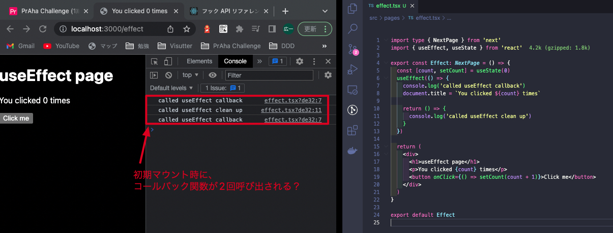

# Effect hookを理解する
## 課題内容

[airtable](https://airtable.com/appWjizyFJue33ycs/tblTnXBXFOYJ0J7lZ/viwyi8muFtWUlhNKG/recQ0t6CPVZ0FGWj5?blocks=hide)

---

## 課題 1
### clean up
- なぜ必要か
  - アンマウントされたDOMに対してステートを更新すると、警告が発生するため
### 第2引数の役割
react index.d.ts より抜粋
```ts
/**
 * Accepts a function that contains imperative, possibly effectful code.
 *
 * @param effect Imperative function that can return a cleanup function
 * @param deps If present, effect will only activate if the values in the list change.
 *
 * @version 16.8.0
 * @see https://reactjs.org/docs/hooks-reference.html#useeffect
 */
function useEffect(effect: EffectCallback, deps?: DependencyList): void;
```

- 役割
  - 副作用のスキップを適用するか判定する
  - 第2引数が指定された場合、指定された値が変更されたときに、useEffectが再実行される
- 挙動
  - 第2引数を指定しない
    - 毎レンダリング後に useEffect が実行される
  - 第2引数に`[]`を指定する
    - 初回レンダリング時のみ、useEffect が実行される

### 疑問点
#### 1 useEffect の callback と clean up が初回レンダリング時に意図しない挙動になる
- わかっていること
  - useEffect は、レンダーの後に実行される
    - つまり、初期マウントやDOMの更新ごとに実行される
  - useEffect のクリーンアップは、DOMの再レンダリングやアンマウント時に実行される
- わかっていないこと
  - 初期リロード時に、useEffect の callback → cleanup → callback が実行されている理由
    - 期待値：callback のみ実行
    - 実測値：callback → cleanup → callback が実行
        

- 調査結果
  - 理由
    - React18 では、開発BuildでStrictモードを有効にしている場合、初回レンダリング時に`mount`→`unmount`→`mount` と呼び出されるから
    - Production Build では、1度しか mount は呼び出されない
  - 記事
    - [React18でのStrictモードとuseEffectの挙動](https://www.sunapro.com/react18-strict-mode/)
      > さて、React18のStrictモードでは上記の挙動に併せて、初回レンダリング時にmount→unmount→mount という挙動を行うようになった。

## 課題 2
- [PR/解法1](https://github.com/kooooichi24/use-effect-demo/pull/1)
- [PR/解法2](https://github.com/kooooichi24/use-effect-demo/pull/2)
- [PR/解法3](https://github.com/kooooichi24/use-effect-demo/pull/3)

## 課題 3
- [PR](https://github.com/kooooichi24/use-effect-demo/pull/4)

## 課題 4

### 参考記事
- [Understanding React’s useEffect cleanup function](https://blog.logrocket.com/understanding-react-useeffect-cleanup-function/)
- [React：非同期の副作用フック(useEffect)で正しくクリーンアップする](https://takamints.hatenablog.jp/entry/cleanup-an-async-use-effect-hook-of-react-function-componet)
- [React17におけるuseEffectの破壊的変更を理解する](https://zenn.dev/uhyo/articles/react17-useeffect)
- [React Hooksでは非同期処理はuseEffect内で行うことと言われていますが、必ずそうしなければならないのでしょうか？](https://ja.stackoverflow.com/questions/86135/react-hooks%E3%81%A7%E3%81%AF%E9%9D%9E%E5%90%8C%E6%9C%9F%E5%87%A6%E7%90%86%E3%81%AFuseeffect%E5%86%85%E3%81%A7%E8%A1%8C%E3%81%86%E3%81%93%E3%81%A8%E3%81%A8%E8%A8%80%E3%82%8F%E3%82%8C%E3%81%A6%E3%81%84%E3%81%BE%E3%81%99%E3%81%8C-%E5%BF%85%E3%81%9A%E3%81%9D%E3%81%86%E3%81%97%E3%81%AA%E3%81%91%E3%82%8C%E3%81%B0%E3%81%AA%E3%82%89%E3%81%AA%E3%81%84%E3%81%AE%E3%81%A7%E3%81%97%E3%82%87%E3%81%86%E3%81%8B)
- [A Simple Explanation of React.useEffect()](https://dmitripavlutin.com/react-useeffect-explanation/#:~:text=useEffect(callback%2C%20dependencies)%20is,being%20props%20or%20state%20values.)
- [【React】再レンダリングの仕組みと最適化](https://zenn.dev/b1essk/articles/react-re-rendering)