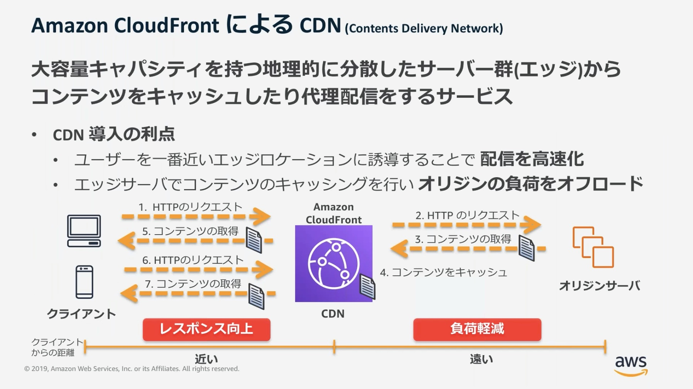
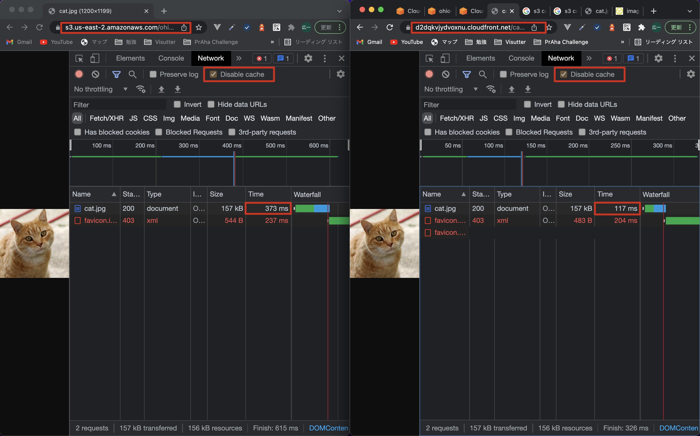
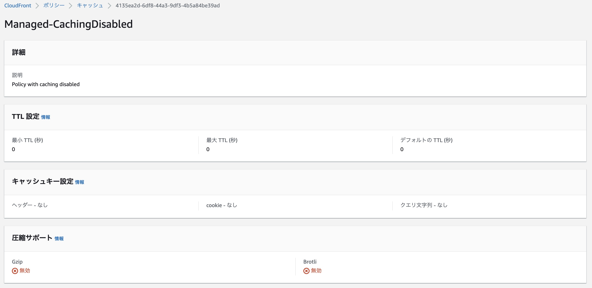

# CDN(CloudFront)について理解して使ってみよう

## 課題内容

[airtable](https://airtable.com/appWjizyFJue33ycs/tblTnXBXFOYJ0J7lZ/viwyi8muFtWUlhNKG/recUdriMxsH73L2Ya?blocks=hide)

---

## 課題 1

### 1.

- 負荷分散
  - エッジサーバにキャッシュされたコンテンツにより、不要なトラフィックをオリジンサーバにリクエストしないため、オリジンサーバの負荷分散に繋がる
- パフォーマンス
  - オリジンサーバと比較してエッジサーバはクライアントからの物理的距離が近くなるため、ネットワーク遅延時間も少なくなるから、パフォーマンスが向上する

#### 参考記事

- [[AWS Black Belt Online Seminar] Amazon CloudFront の概要](https://youtu.be/mmRKzzOvJJY?t=601)

  

### 2.

| -                      | オリジンサーバ                         | エッジサーバ                                                                 |
| ---------------------- | -------------------------------------- | ---------------------------------------------------------------------------- |
| 役割                   | コンテンツのオリジナル版が含まれている | コンテンツの保存やキャッシュすることで、負荷分散とパフォーマンスを向上させる |
| 配置場所               | 配置した場所                           | 世界順のさまざまな場所                                                       |
| クライアントからの距離 | 遠い                                   | 近い                                                                         |

### 3.

- 利点
  - 自分以外のクライアントのリクエストによっても、エッジサーバーにキャッシュが保存される点
  - 自分は初めてリクエストするけど、既にエッジサーバにキャッシュが存在するため、レスポンス時間が早くなることなどがあり得る
- ユースケース
  - 大量のアクセス数が存在するサービス

## 課題 2

### S3(米国東部 (オハイオ) us-east-2) vs CloudFront

- 初回実行時のレスポンス時間
  | First Access  | S3 us-east-2  | CloudFront |
  | ------------- | ------------- | ---------- |
  | Response Time | 2.0s          | 600ms      |
- 複数回実行時のレスポンス時間
  | Multiple Access | S3 us-east-2  | CloudFront |
  | --------------- | ------------- | ---------- |
  | Response Time   | 300~900ms     | 100~250ms  |
- 実行結果
  
  ```bash
  furukawakoichi ~ % curl -I https://s3.us-east-2.amazonaws.com/ohio-1.fu-ru.link/cat.jpg
  HTTP/1.1 200 OK
  x-amz-id-2: vxttvXee5UGm0yTqfpFAv7diDAZ7r19WKeRz2qGcN629RN4Hk8jk3C3jh08QLHH/m9moSYJlZu4=
  x-amz-request-id: 92J6WQHJN04YNQHX
  Date: Sat, 18 Dec 2021 11:48:35 GMT
  Last-Modified: Sat, 18 Dec 2021 11:39:44 GMT
  ETag: "63003ac4690522da8571d37c7879be68"
  Cache-Control: no-store # S3 オブジェクトをキャッシュしないように追加 (しかし、効果なし?)
  Accept-Ranges: bytes
  Content-Type: image/jpeg
  Server: AmazonS3
  Content-Length: 156145
  ```

#### 参考

- [簡単な CloudFront ディストリビューションの開始方法](https://docs.aws.amazon.com/ja_jp/AmazonCloudFront/latest/DeveloperGuide/GettingStarted.SimpleDistribution.html)
- [S3にアップロードされた画像にCache-Controlを付与する](https://qiita.com/suzuki-koya/items/42fa6699134bd8b73b85)
- [Cache-Control](https://developer.mozilla.org/ja/docs/Web/HTTP/Headers/Cache-Control)
- [猫の日](https://ja.wikipedia.org/wiki/%E7%8C%AB%E3%81%AE%E6%97%A5)

## 課題中に湧いてきた疑問

### 1

#### Question

- CloudFrontのキャッシュをどうやって無効にできるのかな
- そもそもCloudFrontのキャッシュ周りの設定がよくわからんぞ

#### Answer

- キャッシュポリシーで設定を変更できる
  - 場所
    - CloudFront ディストリビューション/ビヘイビアを編集/キャッシュキーとオリジンリクエスト/Cache policy and origin request policy (recommended)/キャッシュポリシー
  - 設定値
    - CashingDisabled
      
  - レスポンスタイム
    - 1.0s (デフォルト設定のCachingOptimizedのときは、100~250ms)

#### 参考記事
- [管理キャッシュポリシーの使用](https://docs.aws.amazon.com/ja_jp/AmazonCloudFront/latest/DeveloperGuide/using-managed-cache-policies.html)
  - > 名前: CachingDisabled
    > 
    > ID: 4135ea2d-6df8-44a3-9df3-4b5a84be39ad
    > 
    > このポリシーは、キャッシュを無効にします。このポリシーは、動的コンテンツとキャッシュできないリクエストに役立ちます。
- [CloudFront の Cache Policy と Origin Request Policy を理解する](https://qiita.com/t-kigi/items/6d7cfccdb629690b8d29)
