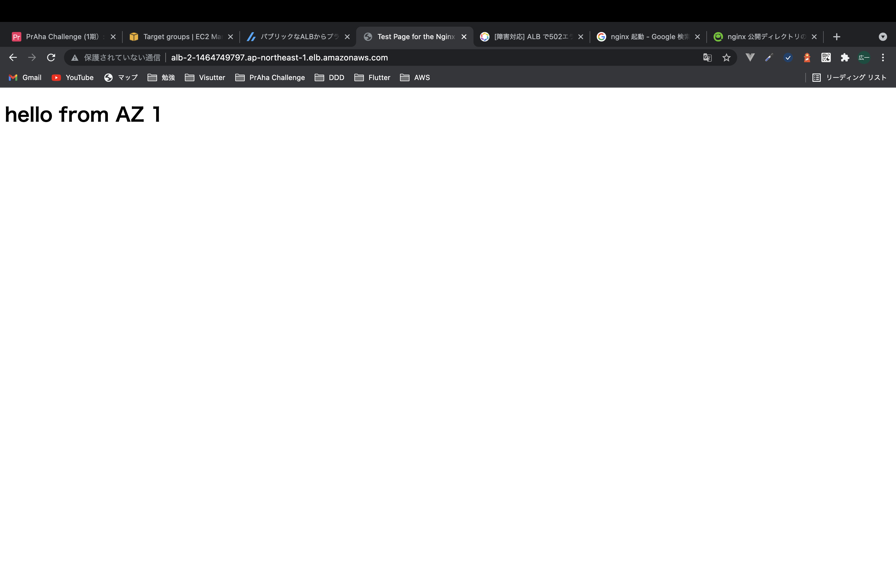
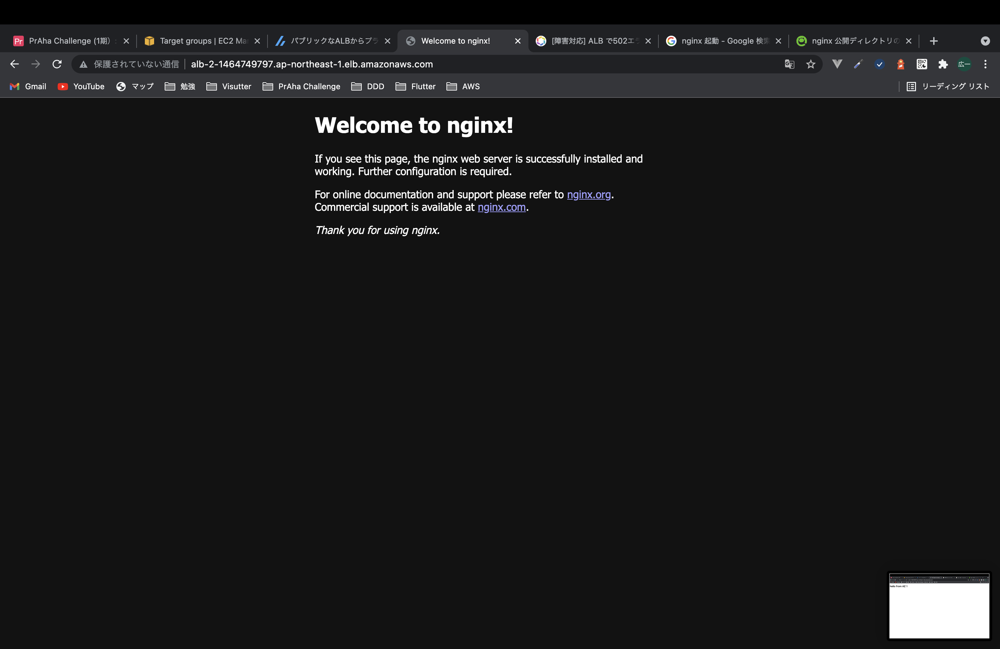

# 冗長化された Web アプリケーションを作ってみよう

## 課題内容

[airtable](https://airtable.com/appWjizyFJue33ycs/tblTnXBXFOYJ0J7lZ/viwyi8muFtWUlhNKG/recYNfNgCPRQudSLz?blocks=hide)

---

## 課題 1

### 1

#### ざっくりとした構成

- VPC
  - az1
    - public subnet
      - ALB
      - NAT Gateway (attached EIP)
      - EC2 (踏み台)
    - private subnet
      - EC2
  - az2
    - public subnet
      - NAT Gateway (attached EIP)
      - EC2 (踏み台)
    - private subnet
      - EC2

#### 前提

- private subnet に構築する EC2 からインターネットに接続できる必要がある。なぜなら、nginx をインストールするためにインターネットへ接続するからだ。

#### EC2 に Nginx を導入

1. 導入

   ```sh
   # Amazon Linux Extrasを確認する
   [ec2-user@ip-10-0-1-12 ~]$ amazon-linux-extras list
     0  ansible2                 available    \
           [ =2.4.2  =2.4.6  =2.8  =stable ]
     2  httpd_modules            available    [ =1.0  =stable ]
     3  memcached1.5             available    \
           [ =1.5.1  =1.5.16  =1.5.17 ]
     5  postgresql9.6            available    \
     ...
     38  nginx1                   available    [ =stable ]

   # nginxをインストールする
   [ec2-user@ip-10-0-1-12 ~]$ sudo amazon-linux-extras install -y nginx1
   Installing nginx
   読み込んだプラグイン:extras_suggestions, langpacks, priorities, update-motd
   リポジトリーを清掃しています: amzn2-core amzn2extra-docker amzn2extra-kernel-5.10 amzn2extra-nginx1
   17 個の metadata ファイルを削除しました
   6 個の sqlite ファイルを削除しました
   0 個の metadata ファイルを削除しました
   読み込んだプラグイン:extras_suggestions, langpacks, priorities, update-motd
   amzn2-core
   ...

   # nginxを起動する
   [ec2-user@ip-10-0-1-12 ~]$ sudo systemctl start nginx
   ```

2. 確認

   ```sh
   # 踏み台EC2からcurl
   [ec2-user@ip-10-0-0-27 ~]$ curl -I http://10.0.1.12
   HTTP/1.1 200 OK
   Server: nginx/1.20.0
   Date: Thu, 02 Dec 2021 17:02:39 GMT
   Content-Type: text/html
   Content-Length: 313
   Last-Modified: Thu, 02 Dec 2021 15:44:31 GMT
   Connection: keep-alive
   ETag: "61a8e9df-139"
   Accept-Ranges: bytes
   ```

#### 結果

ALB の A レコード(alb-2-1464749797.ap-northeast-1.elb.amazonaws.com)にブラウザでアクセスする



### 参考資料

- [パブリックな ALB からプライベートな EC2 にアクセスしてみた](https://zenn.dev/mn87/articles/b6a5e0e5b5ee4c)
- [【AWS EC2】Amazon Linux2 に nginx をインストールする方法](https://qiita.com/tamorieeeen/items/07743216a3662cfca890)

### 感想

- テンプレート化しないと、削除し忘れがあって、コスト高くなる、、
