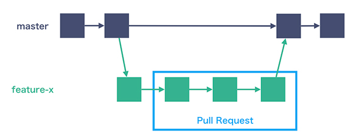

# ブランチ戦略を学ぼう

## 課題内容

[airtable](https://airtable.com/appWjizyFJue33ycs/tblTnXBXFOYJ0J7lZ/viwyi8muFtWUlhNKG/recmyuKaMzvKB99nz?blocks=hide)

---

## 課題 1
### 1. GitHub Flow
[【図解】git-flow、GitHub Flowを開発現場で使い始めるためにこれだけは覚えておこう](https://atmarkit.itmedia.co.jp/ait/articles/1708/01/news015.html) より引用

### 2. Gitflow
[A successful Git branching model](https://nvie.com/posts/a-successful-git-branching-model/)より引用

### 3. GitHub Flow と Gitflow のメリット・デメリット

- GitHub Flow
  - メリット
    - シンプル
    - 理解しやすい
    - デプロイが容易
  - デメリット
    - リリース文化には適していない
- Gitflow
  - メリット
    - リリースに適している
  - デメリット
    - 複雑

| - | GitHub Flow | Gitflow |
| - | - | - |
| 構成 | シンプル | 複雑 |
| メインブランチ | mastert | master, develop |
| feature branch | master から作成 | develop から作成 |
| 適している文化 | デプロイ文化 | リリース文化 |

### 4. どちらを採用する？

1. GitFlow の考案者は、2020年時点で、**git-flow** を推奨

    > This is not the class of software that I had in mind when I wrote the blog post 10 years ago. If your team is doing continuous delivery of software, I would suggest to adopt a much simpler workflow (like GitHub flow) instead of trying to shoehorn git-flow into your team.

    [Note of reflection (March 5, 2020)](https://nvie.com/posts/a-successful-git-branching-model/#:~:text=This%20is%20not,please%20read%20on.)

2. GitHub Flow の偉い人は、リリース文化ならgit-flow、デプロイ文化ならGitHub Flowとお薦めしている

    > 長いインターバル(リリースの間に数週から数カ月)で定型的なリリースを行わなければならないチームや、ホットフィックスやメンテナンス・ブランチ、そしてごくまれに出荷で発生するその他の事々にとって、 git-flow は意味があり、私はその使用を強く推奨するだろう。
    > 
    > 製品を毎日プッシュし、コンスタントにテストしデプロイするという、出荷の文化を作り上げてきたチームに対して、私はGitHub Flowのようなもっとシンプルな何かを選ぶことをお勧めする。

    [GitHub Flow (Japanese translation)](https://gist.github.com/Gab-km/3705015#%E3%81%BE%E3%81%A8%E3%82%81)

### 質問したいこと
1. 「リリース」と「デプロイ」の違い

    GitHub Flow の説明では、git-flow はリリース中心設計、GitHub Flow はデプロイ中心設計として説明されている。ここで説明されているリリースとデプロイの違いが想像できなかった、、、

    > さて、なぜGitHubではgit-flowを使わないのだろうか？ 私たちが常にデプロイをするから、というのが主な理由ではある。 git-flowのプロセスは主として「リリース」を中心に設計されている。 私たちはプロダクション環境へのデプロイを毎日（たいていは日に何回も）行うため、「リリース」というものがない。 

    [GitHub Flow (Japanese translation)](https://gist.github.com/Gab-km/3705015#:~:text=%E3%81%95%E3%81%A6%E3%80%81%E3%81%AA%E3%81%9B%E3%82%99github%E3%81%A6%E3%82%99%E3%81%AFgit-flow%E3%82%92%E4%BD%BF%E3%82%8F%E3%81%AA%E3%81%84%E3%81%AE%E3%81%9F%E3%82%99%E3%82%8D%E3%81%86%E3%81%8B%3F%20%E7%A7%81%E3%81%9F%E3%81%A1%E3%81%8B%E3%82%99%E5%B8%B8%E3%81%AB%E3%83%86%E3%82%99%E3%83%95%E3%82%9A%E3%83%AD%E3%82%A4%E3%82%92%E3%81%99%E3%82%8B%E3%81%8B%E3%82%89%E3%80%81%E3%81%A8%E3%81%84%E3%81%86%E3%81%AE%E3%81%8B%E3%82%99%E4%B8%BB%E3%81%AA%E7%90%86%E7%94%B1%E3%81%A6%E3%82%99%E3%81%AF%E3%81%82%E3%82%8B%E3%80%82%20git-flow%E3%81%AE%E3%83%95%E3%82%9A%E3%83%AD%E3%82%BB%E3%82%B9%E3%81%AF%E4%B8%BB%E3%81%A8%E3%81%97%E3%81%A6%E3%80%8C%E3%83%AA%E3%83%AA%E3%83%BC%E3%82%B9%E3%80%8D%E3%82%92%E4%B8%AD%E5%BF%83%E3%81%AB%E8%A8%AD%E8%A8%88%E3%81%95%E3%82%8C%E3%81%A6%E3%81%84%E3%82%8B%E3%80%82%20%E7%A7%81%E3%81%9F%E3%81%A1%E3%81%AF%E3%83%95%E3%82%9A%E3%83%AD%E3%82%BF%E3%82%99%E3%82%AF%E3%82%B7%E3%83%A7%E3%83%B3%E7%92%B0%E5%A2%83%E3%81%B8%E3%81%AE%E3%83%86%E3%82%99%E3%83%95%E3%82%9A%E3%83%AD%E3%82%A4%E3%82%92%E6%AF%8E%E6%97%A5(%E3%81%9F%E3%81%84%E3%81%A6%E3%81%84%E3%81%AF%E6%97%A5%E3%81%AB%E4%BD%95%E5%9B%9E%E3%82%82)%E8%A1%8C%E3%81%86%E3%81%9F%E3%82%81%E3%80%81%E3%80%8C%E3%83%AA%E3%83%AA%E3%83%BC%E3%82%B9%E3%80%8D%E3%81%A8%E3%81%84%E3%81%86%E3%82%82%E3%81%AE%E3%81%8B%E3%82%99%E3%81%AA%E3%81%84%E3%80%82%20)

    > デスクトップ／モバイルアプリケーションのように「リリース」を必要とするソフトウェアの開発に適しています。

    [git-flow](https://atmarkit.itmedia.co.jp/ait/articles/1708/01/news015.html#:~:text=%E3%83%86%E3%82%99%E3%82%B9%E3%82%AF%E3%83%88%E3%83%83%E3%83%95%E3%82%9A%2F%E3%83%A2%E3%83%8F%E3%82%99%E3%82%A4%E3%83%AB%E3%82%A2%E3%83%95%E3%82%9A%E3%83%AA%E3%82%B1%E3%83%BC%E3%82%B7%E3%83%A7%E3%83%B3%E3%81%AE%E3%82%88%E3%81%86%E3%81%AB%E3%80%8C%E3%83%AA%E3%83%AA%E3%83%BC%E3%82%B9%E3%80%8D%E3%82%92%E5%BF%85%E8%A6%81%E3%81%A8%E3%81%99%E3%82%8B%E3%82%BD%E3%83%95%E3%83%88%E3%82%A6%E3%82%A7%E3%82%A2%E3%81%AE%E9%96%8B%E7%99%BA%E3%81%AB%E9%81%A9%E3%81%97%E3%81%A6%E3%81%84%E3%81%BE%E3%81%99%E3%80%82)

## 参考記事
- [GitHub Flow (Japanese translation)](https://gist.github.com/Gab-km/3705015)
- [A successful Git branching model](https://nvie.com/posts/a-successful-git-branching-model/)
- [【図解】git-flow、GitHub Flowを開発現場で使い始めるためにこれだけは覚えておこう](https://atmarkit.itmedia.co.jp/ait/articles/1708/01/news015.html)