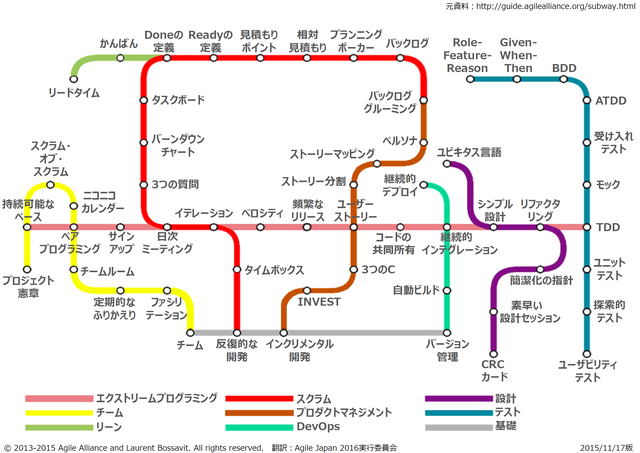
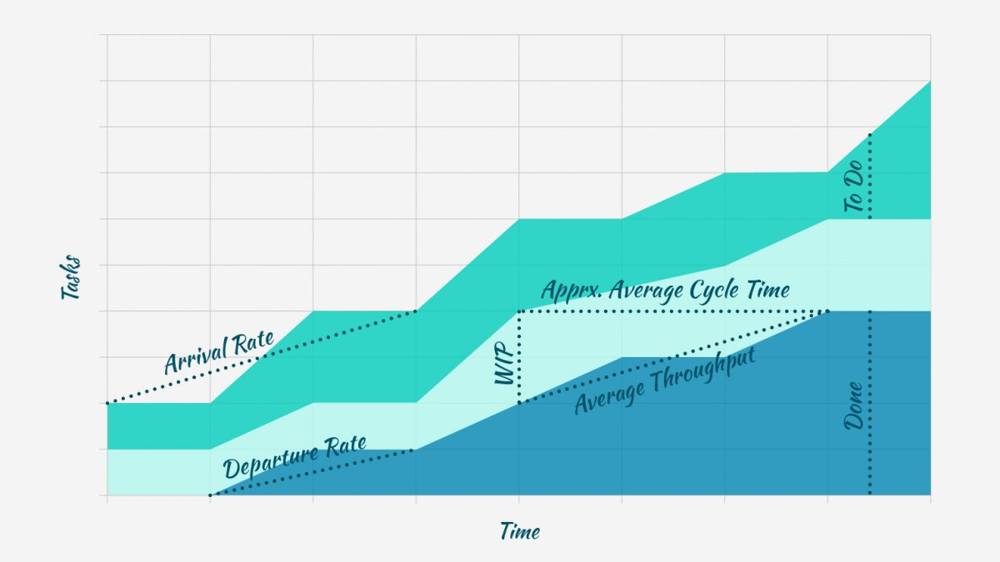
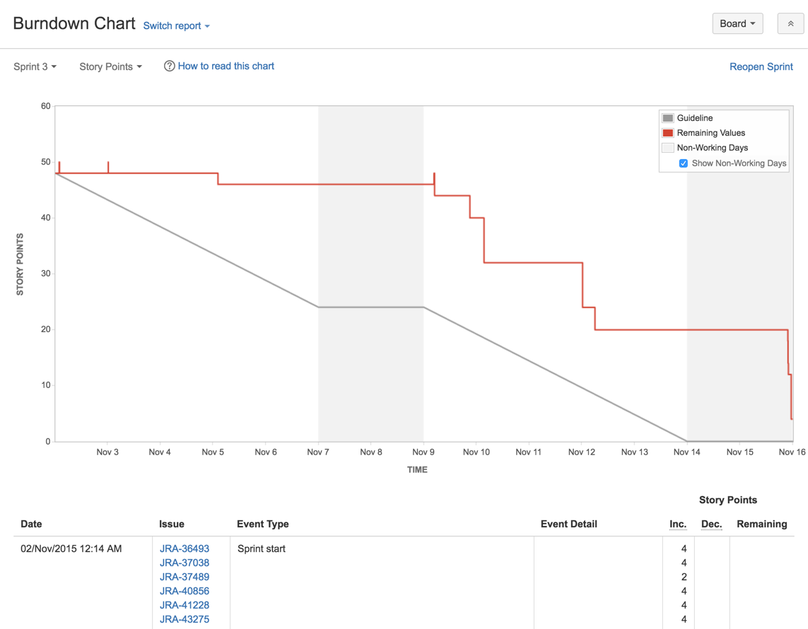
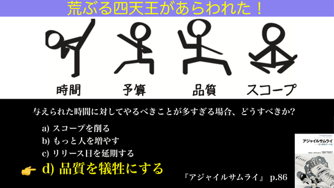

# アジャイル開発を学ぼう

# 課題内容

[airtable](https://airtable.com/appWjizyFJue33ycs/tblTnXBXFOYJ0J7lZ/viwyi8muFtWUlhNKG/recj6oOEPPrtGP8Vn?blocks=hide)

---

# 課題 1
## アジャイルとは
- アジャイルの目的
  - > アジャイルとは、変化を生み出し、それに対応する能力である。不確実で激動する環境に対処し、最終的に成功するための方法です。
  - [What is Agile?](https://www.agilealliance.org/agile101/#:~:text=Introductory%20Videos-,what%20is%20agile%3F,-Agile%20is%20the)
- アジャイル開発とは
  - > アジャイルソフトウェア開発とは、「アジャイルソフトウェア開発宣言」とその背後にある「12の原則」で示された価値観と原則に基づく一連のフレームワークとプラクティスの包括的な用語である。
  - [What is Agile Software Development? | Agile Alliance](https://www.agilealliance.org/agile101/#:~:text=what%20is%20agile%20software%20development%3F)
- どんな問題を解決するか
  - 不確実性に対処する
- 参考資料
  - [アジャイルが何なのか絶対に理解できます。アジャイル迷子のための「アジャイルの本質」](https://youtu.be/XXLbkYndAJ4)

## 開発スピードが上がる？
- 回答
  - 相対的に、上がることが多い
- 前提
  - 時間当たりの、開発の成果物は同じ（スキルが同じ場合）
- 理由
  - 変化に対応しやすくなるから

## XP
### ユーザストーリー
- ユーザストーリーとは
  - 顧客に見える機能の単位を記述したもの
- テンプレート
  - {役割}として{機能や性能}を実現したい。なぜなら、{ビジネス価値}だからだ。
- なぜユーザストーリを書くのか
  - ユーザーが機能を求める理由を明確にすることで、PO ⇄ Dev で機能の詳細について議論するため
- アンチパターン
  1. Whyに関して記述がない
  2. 受入条件が存在しない
  3. ユーザに価値を提供していない
  4. 大きすぎる（スプリント期間で終了できないくらい）
- 具体的に書かない方が良い理由
  - そもそも、ユーザストーリーは機能の詳細な仕様ではなく、PO ⇄ Dev で詳細を議論するための道具である。
  - 「なぜ機能を実装する必要があるか」の目的について、認識の齟齬が発生しなければ良い。
  - 具体的に書きすぎると、機能を実装する目的が不明確になり、議論しづらくなるからだ。

- 参考資料
  - [ユーザーストーリーとは？](https://slide.meguro.ryuzee.com/slides/48)
  - [より良いユーザーストーリーを書くための10個のヒント](https://www.ryuzee.com/contents/blog/3753)
  - [User Story Traps](https://scrumcrazy.wordpress.com/2011/01/05/user-story-traps/)
  - [9 User Story Smells And Anti-Patterns](https://www.kaizenko.com/%EF%BB%BF9-user-story-smells-and-anti-patterns/)
  - [User Stories Writing: Antipatterns](https://medium.com/@carmineingaldi/user-stories-writing-antipatterns-9e9e1ff710b9)
  - [ユーザーストーリー駆動開発で行こう。](https://www.slideshare.net/papanda/ss-41638116)

### ストーリーポイント
- 途中で変えるべきではない
  - なぜなら、原因解明を握り潰すと、振り返りができなくなり、改善ができなくなるから
- 当初見積もった時間
- Dev チーム内で認識の差を埋めるため

### ユーザストーリー vs タスク
ユーザストーリーはユーザに価値を提供するが、タスクは直接的にはユーザに価値を提供しない。タスクの具体例としては、技術検証やチームワークを向上させるための活動などが挙げられる。タスクはユーザに価値を提供しないが、チームにとって価値がある。そのため、タスクの実行することは、最終的にはチームのアウトプットを向上させるものである。またタスクのタイムボックスは、[スプリントの長さの20%程度までの時間が現実的](https://www.ryuzee.com/contents/blog/7121#:~:text=%E3%82%B9%E3%83%95%E3%82%9A%E3%83%AA%E3%83%B3%E3%83%88%E3%81%AE%E9%95%B7%E3%81%95%E3%81%AE20%25%E7%A8%8B%E5%BA%A6%E3%81%BE%E3%81%A6%E3%82%99%E3%81%AE%E6%99%82%E9%96%93%E3%81%8B%E3%82%99%E7%8F%BE%E5%AE%9F%E7%9A%84)である。

### イテレーション
インクリメントを提供するタイムボックスのこと。イテレーション期間はチームによって異なるが、1週間や2週間を設定するチームが多い。
また、イテレーションと似た言葉としてスプリントが存在する。イテレーションとスプリントの違いは、出典元である。イテレーションはXPから生まれた用語であり、スプリントはスクラムから生まれた用語である。

- Tips
  - 開発手法・プロセスごとのプラクティスを路線図で表した図
    
  - 参考資料
    - [Subway Map to Agile Practices](https://www.agilealliance.org/agile101/subway-map-to-agile-practices/)
    - [Scrum Developers Night! Online 〜6th〜](https://techplay.jp/event/827393)

### イテレーション計画
イテレーション期間中に実施する優先順位を付けたバックログを、計画すること。

### リリース計画
初回リリースを見通すもの。

### イテレーション計画 と リリース計画の違い
イテレーション計画は「イテレーション期間を計画」するのに対して、リリース計画は「初回リリースを計画」する。
また、複数回のイテレーションを経て、リリース計画を見積もることが可能となる。

- 参考資料
  - [リリース計画とイテレーション計画の違い](https://scrapbox.io/nobuoka-pub/%E3%83%AA%E3%83%AA%E3%83%BC%E3%82%B9%E8%A8%88%E7%94%BB%E3%81%A8%E3%82%A4%E3%83%86%E3%83%AC%E3%83%BC%E3%82%B7%E3%83%A7%E3%83%B3%E8%A8%88%E7%94%BB%E3%81%AE%E9%81%95%E3%81%84)

### プランニングポーカー
- プランニングポーカーとは
  - バックログのポイントをチームで議論して見積もるための、プラクティス。
- アンチパターン
  - 議論しないこと
    - 議論せずに、ポーカーの結果の平均値のポイントを採用する
  - ポーカーの結果で、分散していることが悪いという考え
  - ポーカーの結果で、分散していないから良いという考え

### ベロシティ
- 優秀か？
  - ベロシティは、チーム間を評価する指標ではない。
  - そのため、ベロシティが2倍だから優秀と、判断できない。
- 未完成
  - 途中進捗のバックログのストーリポイントの一部をベロシティに含めてはいけない
    > 部分的な成果として扱うことはしない（たとえば、ストーリーポイントの一部をベロシティに計上するようなことはしません。完成していないので無意味です）
  - 一方で、部分的に完成している = 価値のある単位 の場合、バックログを分割してDoneにしても良いと個人的に思う
- 参考資料
  - [Q. 着手したもののスプリント中に完成しなかったプロダクトバックログアイテムはどう扱えばいいですか？](https://www.ryuzee.com/faq/0028/)
  - [プロダクトバックログアイテムの分割方法](https://www.ryuzee.com/contents/blog/14554)

### レトロスペクティブ
- レトロスペクティブとは
  - プロセスを検査し、カイゼンするためのミーティング
  - 一言で言い換えると、ふりかえり
- ⽬的
  - 品質と効果を⾼める⽅法を計画すること
- いつ実施するか
  - スプリントの最後
  - レトロスペクティブをもって、スプリントを終了とする
- 目安の時間
  - スプリントが1か⽉の場合、レトロスペクティブは最⼤3時間
- プラクティス
  - KPT
  - YWT（やったこと・わかったこと・つぎやること）
  - [Fun/Done/Learn](https://miro.com/miroverse/fun-done-learn-japanese/)
  - [Win/Learn/Try](https://engineering.mercari.com/blog/entry/2020-06-30-130000/)

- 参考資料
  - [スクラムガイド 2020](https://scrumguides.org/docs/scrumguide/v2020/2020-Scrum-Guide-Japanese.pdf)
  - [ふりかえり手法をふりかえる(KPT, LeanCoffee, Fun/Done/Learn, Timeline, +/Δ)](https://qiita.com/46goh/items/ddfa228acb60d2c34dc4)

## 界隈の用語
- バーンアップチャート
  - 
  - 目的
    - > 残っている作業内容と、スプリントのゴールを達成するためのプロジェクトについて分析します。
      > 
      > これにより進捗と実施内容を適切に管理することができるようになります。
  - メリット
    - 過去の傾向から、直近の変化点に気付きやすくなる
    - 例えば、新規のバックログが急激に増えた場合など
  - デメリット
    - スコープがない？
- バーンダウンチャート
  - 
  - 目的
    - > スプリントのスコープの変更を追跡し、スプリントで完了した作業と全体的なスコープとの比較の可視化を支援します。
      > 
      > チームはこれにより、スプリントまたはリリース プロセスの各段階で進捗を確認できます。
  - メリット
    - 当初の想定通りにコミットメントを達成できそうか、判断する材料になる
    - 締切効果
  - デメリット
    - なんだろう？
    - チーム結成初期やプロジェクトの開始時は、ベロシティが安定していないため、バーンダウンよりもバーンアップの方が良いかも
- ブルックスの法則
  - ブルックスの法則とは
    - > ブルックスの法則（ブルックスのほうそく）はフレデリック・ブルックスによって提唱された、「遅れているソフトウェアプロジェクトへの要員追加は、プロジェクトをさらに遅らせるだけである」という、ソフトウェア開発のプロジェクトマネジメントに関する法則である。これは1975年に出版された著書 "The Mythical Man-Month"（邦題：『人月の神話』[1]）に登場した。
- コンウェイの法則
  - > 「システムを設計する組織は、そのコミュニケーション構造をそっくりまねた構造の設計を生み出してしまう」 (原文: "Organizations which design systems are constrained to produce designs which are copies of the communication structures of these organizations.")
- QCDS（Quality, Cost, Delivery, Scope）
  - 
  - QCDSとは
    - 「荒ぶる四天王」とも呼ばれる
    - プロジェクトを進める上で、考えるべき変数のこと
  - Sprint0 と QCDS の関係性
    - このプロジェクトでは何を大事にするのか、優先順位をはっきりさせるべき
    - そのための手法として、トレードオフ・スライダーがある
  - トレードオフ・スライダーのアンチパターン
    - 全てが最優先
    - 同じ順位の変数
  - 先人たちの知恵
    - 品質（Q）を犠牲にして、時間（D）を優先にすると
      - 短期的にはスピードを得られる
      - 中期的には逆効果
      - 長期的には致命傷

- 参考資料
  - [バーンアップチャートとバーンダウンチャートはどう使い分けますか？](https://agile.quora.com/%E3%83%90%E3%83%BC%E3%83%B3%E3%82%A2%E3%83%83%E3%83%97%E3%83%81%E3%83%A3%E3%83%BC%E3%83%88%E3%81%A8%E3%83%90%E3%83%BC%E3%83%B3%E3%83%80%E3%82%A6%E3%83%B3%E3%83%81%E3%83%A3%E3%83%BC%E3%83%88%E3%81%AF%E3%81%A9%E3%81%86%E4%BD%BF%E3%81%84%E5%88%86%E3%81%91%E3%81%BE%E3%81%99%E3%81%8B)
  - [差し込みの多いプロダクト開発のスケジュールの精度を上げるためにはバーンアップチャートがおすすめです](https://blog.studysapuri.jp/entry/2021/02/08/080000)
  - [ブルックスの法則](https://ja.wikipedia.org/wiki/%E3%83%96%E3%83%AB%E3%83%83%E3%82%AF%E3%82%B9%E3%81%AE%E6%B3%95%E5%89%87)
  - [Conway's law](https://en.wikipedia.org/wiki/Conway%27s_law)
  - [質とスピード（2022春版、質疑応答用資料付き）](https://speakerdeck.com/twada/quality-and-speed-2022-spring-edition)