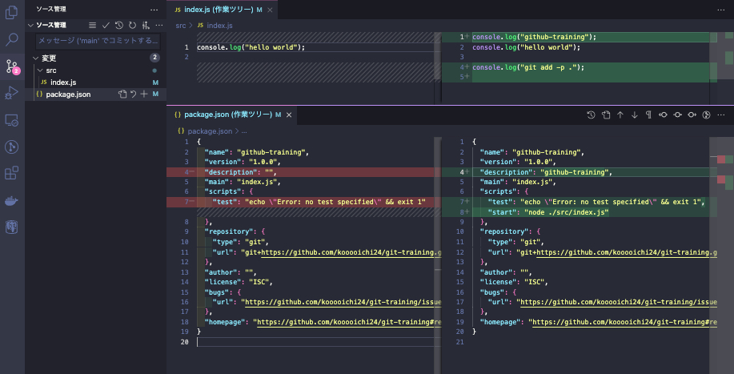
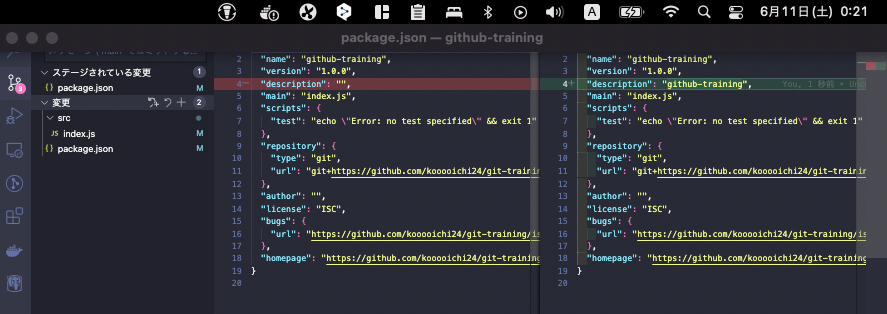

# Gitの便利コマンドを覚える

## 課題内容

[airtable](https://airtable.com/appWjizyFJue33ycs/tblTnXBXFOYJ0J7lZ/viwyi8muFtWUlhNKG/recFbwza5RhBwdq3O?blocks=hide)

---

## 課題 1
### 1. 差分

コミット間の比較
`git diff <commit sha 1> <commit sha 2>`

```sh
$ git diff 25690f59b6bea6c7e0f62fc17d9e2cd9aecccdd0 bf5ac46bbd80e28129718a1e9a3fb594225dba4f
diff --git a/package.json b/package.json
new file mode 100644
index 0000000..e21c559
--- /dev/null
+++ b/package.json
@@ -0,0 +1,19 @@
+{
+  "name": "github-training",
+  "version": "1.0.0",
+  "description": "",
+  "main": "index.js",
+  "scripts": {
+    "test": "echo \"Error: no test specified\" && exit 1"
+  },
+  "repository": {
+    "type": "git",
+    "url": "git+https://github.com/kooooichi24/git-training.git"
+  },
+  "author": "",
+  "license": "ISC",
+  "bugs": {
+    "url": "https://github.com/kooooichi24/git-training/issues"
+  },
+  "homepage": "https://github.com/kooooichi24/git-training#readme"
+}
```

現在のブランチと、あるコミットの差分を比較する
`git diff <commit hash>`
```sh
$ git diff 25690f59b6bea6c7e0f62fc17d9e2cd9aecccdd0                                          
diff --git a/package.json b/package.json
new file mode 100644
index 0000000..e21c559
--- /dev/null
+++ b/package.json
@@ -0,0 +1,19 @@
+{
+  "name": "github-training",
+  "version": "1.0.0",
+  "description": "",
+  "main": "index.js",
+  "scripts": {
+    "test": "echo \"Error: no test specified\" && exit 1"
+  },
+  "repository": {
+    "type": "git",
+    "url": "git+https://github.com/kooooichi24/git-training.git"
+  },
+  "author": "",
+  "license": "ISC",
+  "bugs": {
+    "url": "https://github.com/kooooichi24/git-training/issues"
+  },
+  "homepage": "https://github.com/kooooichi24/git-training#readme"
+}
diff --git a/src/index.js b/src/index.js
new file mode 100644
index 0000000..6b2b3db
--- /dev/null
+++ b/src/index.js
@@ -0,0 +1 @@
+console.log("hello world");
```

今回コミットした変更点を見る
`git diff HEAD^`
```sh
$ git diff HEAD^                                   

diff --git a/src/index.js b/src/index.js
new file mode 100644
index 0000000..6b2b3db
--- /dev/null
+++ b/src/index.js
@@ -0,0 +1 @@
+console.log("hello world");
```

### 2. 差分あるファイル名の一覧表示

```sh
$ git diff --name-only HEAD^ 
src/index.js
```

### 3. patchモード

現状の変更状態


- 実現したいこと
  - `package.json` の `description` の変更のみステージングに移動させたい
- 手順
  1. patch モードで git add
      ```sh
      $ git add -p .
      diff --git a/package.json b/package.json
      index e21c559..9f0b968 100644
      --- a/package.json
      +++ b/package.json
      @@ -1,10 +1,11 @@
       {
         "name": "github-training",
         "version": "1.0.0",
      -  "description": "",
      +  "description": "github-training",
         "main": "index.js",
         "scripts": {
      -    "test": "echo \"Error: no test specified\" && exit 1"
      +    "test": "echo \"Error: no test specified\" && exit 1",
      +    "start": "node ./src/index.js"
         },
         "repository": {
           "type": "git",
      (1/1) Stage this hunk [y,n,q,a,d,s,e,?]?
      ```
  2. 一部分のみステージングへ反映させたいので、edit モードを選択
      ```sh
      (1/1) Stage this hunk [y,n,q,a,d,s,e,?]? e
      ```
  3. エディター表示
      ```sh
      # Manual hunk edit mode -- see bottom for a quick guide.
      @@ -1,10 +1,11 @@
       {
         "name": "github-training",
         "version": "1.0.0",
      -  "description": "",
      +  "description": "github-training",
         "main": "index.js",
         "scripts": {
      -    "test": "echo \"Error: no test specified\" && exit 1"
      +    "test": "echo \"Error: no test specified\" && exit 1",
      +    "start": "node ./src/index.js"
         },
         "repository": {
           "type": "git",
      # ---
      # To remove '-' lines, make them ' ' lines (context).
      # To remove '+' lines, delete them.
      # Lines starting with # will be removed.
      #
      # If the patch applies cleanly, the edited hunk will immediately be
      # marked for staging.
      # If it does not apply cleanly, you will be given an opportunity to
      # edit again.  If all lines of the hunk are removed, then the edit is
      # aborted and the hunk is left unchanged.
      ~     
      ```
  4. scripts の test の差分を含めないように修正

      test の マイナス(-) を削除 ＆ プラス(+) の行を削除
      ```sh
      # Manual hunk edit mode -- see bottom for a quick guide.
      @@ -1,10 +1,11 @@
       {
         "name": "github-training",
         "version": "1.0.0",
      -  "description": "",
      +  "description": "github-training",
         "main": "index.js",
         "scripts": {
           "test": "echo \"Error: no test specified\" && exit 1"
         },
         "repository": {
           "type": "git",
      # ---
      # To remove '-' lines, make them ' ' lines (context).
      # To remove '+' lines, delete them.
      # Lines starting with # will be removed.
      #
      # If the patch applies cleanly, the edited hunk will immediately be
      # marked for staging.
      # If it does not apply cleanly, you will be given an opportunity to
      # edit again.  If all lines of the hunk are removed, then the edit is
      # aborted and the hunk is left unchanged.
      ~                                         
      ```
  5. エディターの変更を取り込む
  6. 別ファイルの差分の確認
      ```sh
      diff --git a/src/index.js b/src/index.js
      index 6b2b3db..101ea2f 100644
      --- a/src/index.js
      +++ b/src/index.js
      @@ -1 +1,4 @@
      +console.log("github-training");
       console.log("hello world");
      +
      +console.log("git add -p .");
      (1/1) Stage this hunk [y,n,q,a,d,s,e,?]? 
      ```
  7. 別ファイルの差分は変更に含めたくないので、no を選択
      ```sh
      (1/1) Stage this hunk [y,n,q,a,d,s,e,?]? n
      ```
- 結果
  
  期待通りに、`package.json` の description のみ変更が反映
  

### 4. 退避

コミットしていない変更を退避する
```sh
$ git stash
```

コミットしていない変更で（新規作成ファイル）も退避する
```sh
$ git stash -u
Saved working directory and index state WIP on main: 512d394 fix: console.lo
```

stash した一覧を見る
```sh
$ git stash list
stash@{0}: WIP on main: 512d394 fix: console.log
```

stash を戻す
```sh
$ git stash apply stash@{0}
Already up to date.
On branch main
Your branch is up to date with 'origin/main'.

Untracked files:
  (use "git add <file>..." to include in what will be committed)
        src/stash.js

nothing added to commit but untracked files present (use "git add" to track)

# stash list からは削除されない
$ git stash list           
stash@{0}: WIP on main: 512d394 fix: console.log
```

stash を適用して、stash list から削除する
```sh
$ git stash pop stash@{0}  
Already up to date.
On branch main
Your branch is up to date with 'origin/main'.

Untracked files:
  (use "git add <file>..." to include in what will be committed)
        src/stash.js

nothing added to commit but untracked files present (use "git add" to track)
Dropped stash@{0} (e5c9675e73444b3bced6f62fc59f6eb9b5210066)
```

#### 疑問
1. stash は stack 構造？

    スタック構造
    > Stashes in Git are put onto a stack, with the most recently-stashed on top.
    > 
    > Git におけるスタッシュは、直近に隠したものを頂点としてスタックに格納されます。(DeepL翻訳)

    [A Hacker's Guide to Git](https://wildlyinaccurate.com/a-hackers-guide-to-git/#:~:text=stack%2C%20with%20the-,most,-recently-stashed%20on)
2. stash は内部的には何を実行している？
    
    merge commit
    > From this we can see that the stash is pointing to a commit object. What’s interesting is that the stash commit is a merge commit.
    > 
    > このことから、スタッシュがコミットオブジェクトを指していることがわかります。興味深いのは、スタッシュのコミットがマージコミットであることです。(DeepL翻訳)

    [A Hacker's Guide to Git](https://wildlyinaccurate.com/a-hackers-guide-to-git/#:~:text=from%20this%20we%20can%20see%20that%20the%20stash%20is%20pointing%20to%20a%20commit%20object.%20what%E2%80%99s%20interesting%20is%20that%20the%20stash%20commit%20is%20a%20merge%20commit.)
3. stash のコミットはどこに保存されている？

    0番目は `.git/refs/stash` に格納される

    0番目~n番目は `.git/logs/refs/stash` に格納される

    ```sh
    $ git show-ref
    512d3945e71973ce71263cdb8efbd99d4394b65f refs/heads/main
    512d3945e71973ce71263cdb8efbd99d4394b65f refs/remotes/origin/main
    d2ce564198ce909ea92f29e30360a9d759b9208a refs/stash # これ
    ```

[Where are the git stash elements stored? Is the data structure really a stack?](https://stackoverflow.com/questions/42863293/where-are-the-git-stash-elements-stored-is-the-data-structure-really-a-stack)

### 5. コミット履歴

下記に 3 パターン記述する

```sh
$ git log --oneline src/index.js 
512d394 (HEAD -> main, origin/main) fix: console.log
fbff8ac add: index.js
```

```sh
$ git log -- src/index.js
commit 512d3945e71973ce71263cdb8efbd99d4394b65f (HEAD -> main, origin/main)
Author: kooooichi24 <ex.kouichi1224@gmail.com>
Date:   Sat Jun 11 00:35:39 2022 +0900

    fix: console.log

commit fbff8ac209128096b5682261f089effcbabd981d
Author: kooooichi24 <ex.kouichi1224@gmail.com>
Date:   Fri Jun 10 23:19:12 2022 +0900

    add: index.js
```

```sh
$ git log -p src/index.js 
commit 512d3945e71973ce71263cdb8efbd99d4394b65f (HEAD -> main, origin/main)
Author: kooooichi24 <ex.kouichi1224@gmail.com>
Date:   Sat Jun 11 00:35:39 2022 +0900

    fix: console.log

diff --git a/src/index.js b/src/index.js
index 6b2b3db..101ea2f 100644
--- a/src/index.js
+++ b/src/index.js
@@ -1 +1,4 @@
+console.log("github-training");
 console.log("hello world");
+
+console.log("git add -p .");

commit fbff8ac209128096b5682261f089effcbabd981d
Author: kooooichi24 <ex.kouichi1224@gmail.com>
Date:   Fri Jun 10 23:19:12 2022 +0900

    add: index.js

diff --git a/src/index.js b/src/index.js
new file mode 100644
index 0000000..6b2b3db
--- /dev/null
+++ b/src/index.js
@@ -0,0 +1 @@
+console.log("hello world");
```

### 6. rebase

複数のコミットを一つにまとめる

1. interactive 
    ```sh
    $ git rebase -i
    ```
2. squash
    ```sh
    pick 490e798 fix: clear rebase.js
    s a5ea38d fix: base command
    s 5ec242a fix: interactive option
    s 0354d4a fix: squash mode
    s 4051fb0 fix: fixup mode
    s ac97980 fix: drop mode

    # Rebase 45c73a1..ac97980 onto 45c73a1 (6 commands)
    #
    # Commands:
    # p, pick <commit> = use commit
    # r, reword <commit> = use commit, but edit the commit message
    # e, edit <commit> = use commit, but stop for amending
    # s, squash <commit> = use commit, but meld into previous commit
    # f, fixup [-C | -c] <commit> = like "squash" but keep only the previous
    #                    commit's log message, unless -C is used, in which case
    #                    keep only this commit's message; -c is same as -C but
    #                    opens the editor
    # x, exec <command> = run command (the rest of the line) using shell
    # b, break = stop here (continue rebase later with 'git rebase --continue')
    # d, drop <commit> = remove commit
    # l, label <label> = label current HEAD with a name
    # t, reset <label> = reset HEAD to a label
    # m, merge [-C <commit> | -c <commit>] <label> [# <oneline>]
    # .       create a merge commit using the original merge commit's
    # .       message (or the oneline, if no original merge commit was
    # .       specified); use -c <commit> to reword the commit message
    #
    # These lines can be re-ordered; they are executed from top to bottom.
    #
    # If you remove a line here THAT COMMIT WILL BE LOST.
    #
    # However, if you remove everything, the rebase will be aborted.
    #
    ~
    ```

### 7. 新たなブランチ

```sh
$ git checkout -b develop
$ git checkout -b stg
```

### 8. 最新コミットのclone

master の最新の履歴のみ取得
```sh
$ git clone --depth 1 <repository>
```

全てのブランチの最新の履歴を取得
```sh
$ git clone --depth 1 --no-single-branch <repository>
```

### 9. マージ中断

```sh
$ git merge --abort
```

## 参考記事
- [忘れやすい人のための git diff チートシート](https://qiita.com/shibukk/items/8c9362a5bd399b9c56be)
- [Gitで部分的にコミットする方法](https://qiita.com/miyohide/items/79ab0ff3b3852289a6be)
- [Where are the git stash elements stored? Is the data structure really a stack?](https://stackoverflow.com/questions/42863293/where-are-the-git-stash-elements-stored-is-the-data-structure-really-a-stack)
- [【git stash】コミットはせずに変更を退避したいとき](https://qiita.com/chihiro/items/f373873d5c2dfbd03250)
- [.git の中を観察してみた](https://qiita.com/Teloo/items/df14ef860a216a08e9a6)